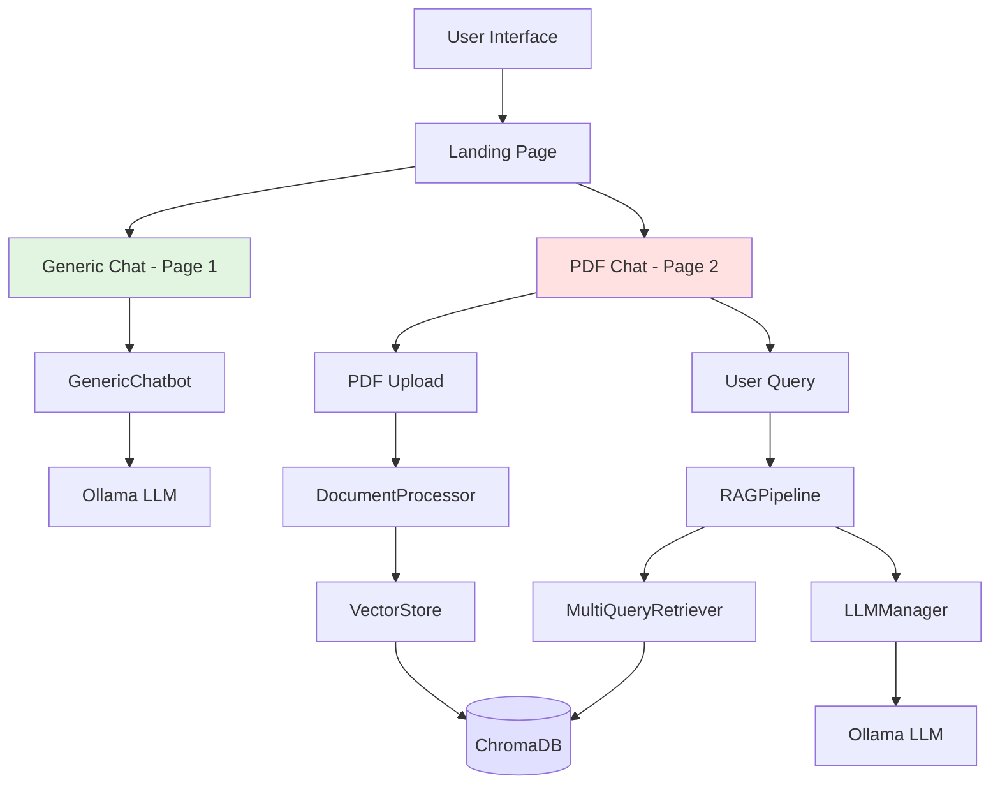
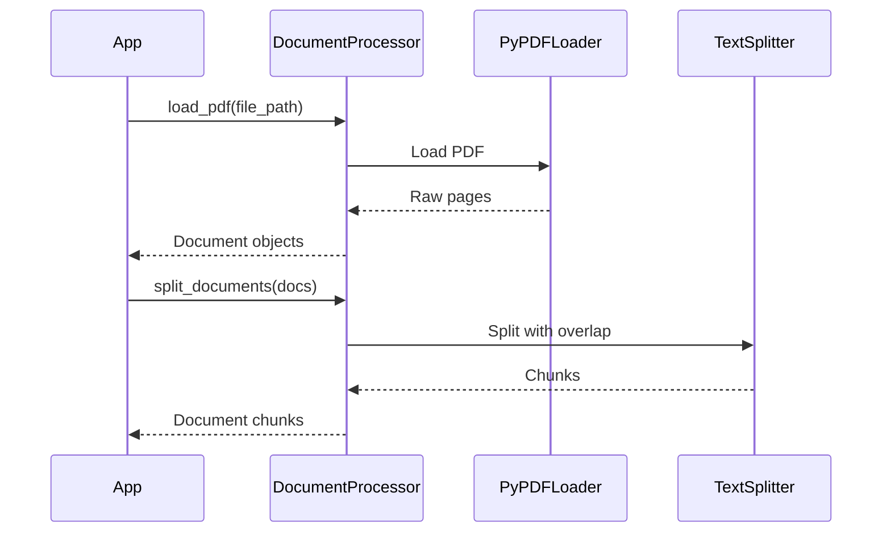
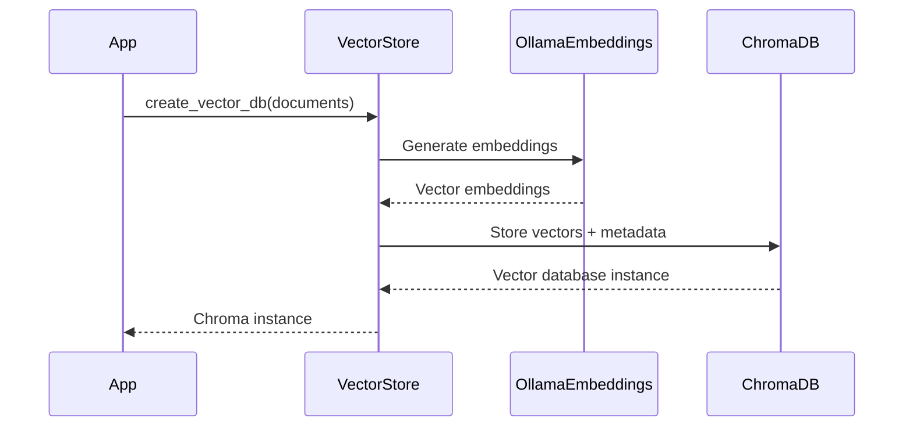
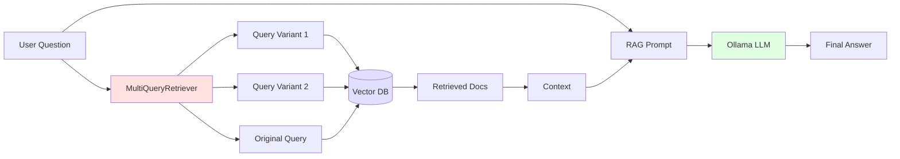
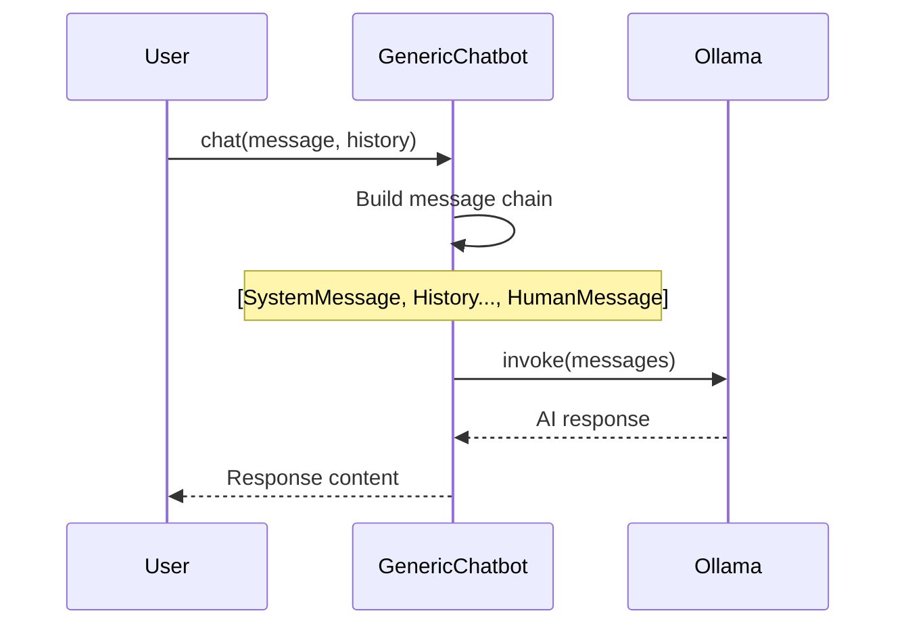
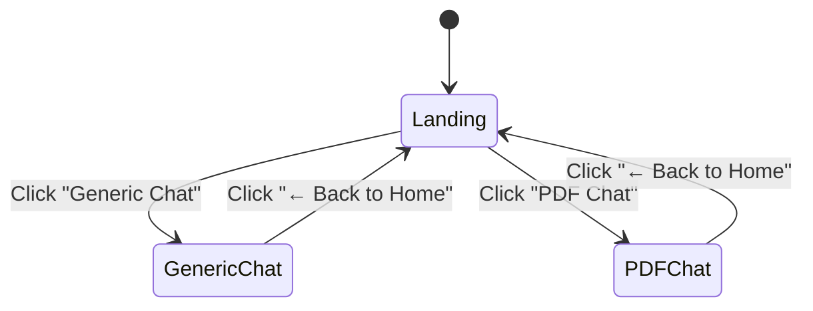
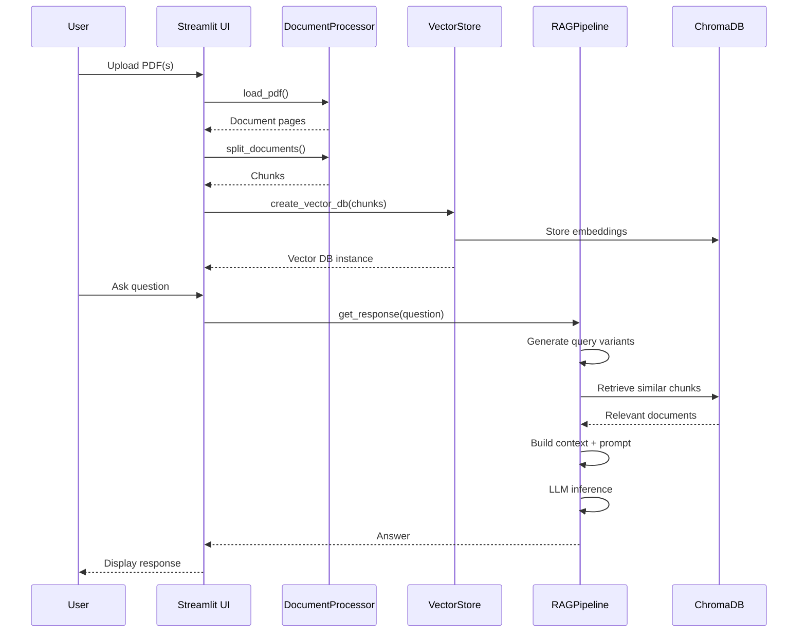
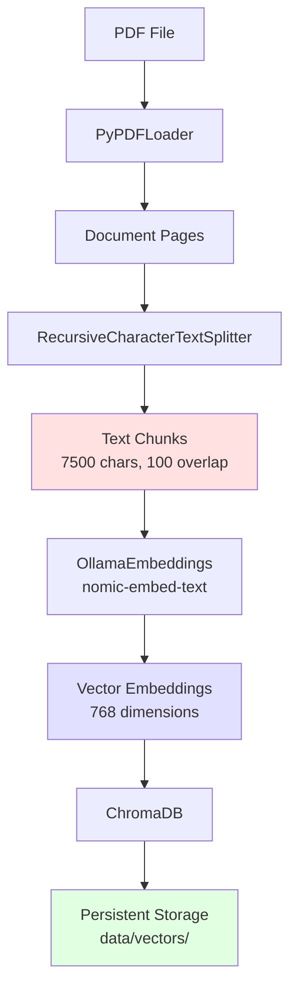
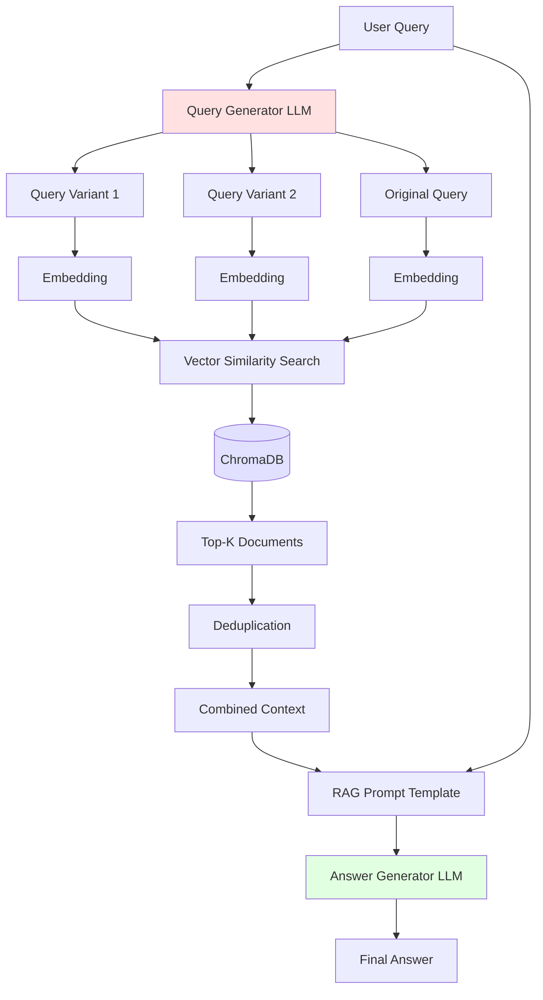

# Technical Workflow Documentation

## Table of Contents
1. [System Architecture](#system-architecture)
2. [Core Modules](#core-modules)
3. [Application Flow](#application-flow)
4. [Data Flow](#data-flow)
5. [Technical Implementation Details](#technical-implementation-details)
6. [API Reference](#api-reference)

---

## System Architecture

### High-Level Architecture



### Component Overview

The system consists of three main layers:

1. **Presentation Layer**: Streamlit UI with landing page and dual chat modes
2. **Business Logic Layer**: Core modules for document processing, RAG pipeline, and chatbot
3. **Data Layer**: ChromaDB vector database and Ollama models

---

## Core Modules

### 1. DocumentProcessor (`src/core/document.py`)

**Purpose**: Handles PDF document loading and intelligent text chunking.

**Key Components**:
- `PyPDFLoader`: Extracts text from PDF files
- `RecursiveCharacterTextSplitter`: Chunks documents for optimal retrieval

**Default Configuration**:
```python
chunk_size = 7500       # Characters per chunk
chunk_overlap = 100     # Overlap between chunks
```

**Workflow**:


**Methods**:
- `load_pdf(file_path)`: Load single PDF file
- `load_multiple_pdfs(file_paths)`: Load multiple PDFs and combine
- `split_documents(documents)`: Split documents into chunks

---

### 2. VectorStore (`src/core/embeddings.py`)

**Purpose**: Manages vector embeddings and ChromaDB operations.

**Key Components**:
- `OllamaEmbeddings`: Generates embeddings using `nomic-embed-text` model
- `Chroma`: Vector database for similarity search

**Configuration**:
```python
embedding_model = "nomic-embed-text"  # Default embedding model
collection_name = "local-rag"          # Default collection name
```

**Workflow**:


**Methods**:
- `create_vector_db(documents, collection_name)`: Create vector database from documents
- `delete_collection()`: Delete vector database collection

---

### 3. LLMManager (`src/core/llm.py`)

**Purpose**: Manages LLM configuration and prompt templates.

**Key Components**:
- `ChatOllama`: Interface to Ollama models
- Prompt templates for query generation and RAG

**Prompt Templates**:

**Multi-Query Prompt**:
```
You are an AI language model assistant. Your task is to generate 2
different versions of the given user question to retrieve relevant documents from
a vector database. By generating multiple perspectives on the user question, your
goal is to help the user overcome some of the limitations of the distance-based
similarity search. Provide these alternative questions separated by newlines.
Original question: {question}
```

**RAG Prompt**:
```
Answer the question based ONLY on the following context:
{context}
Question: {question}
```

**Methods**:
- `get_query_prompt()`: Returns multi-query generation prompt
- `get_rag_prompt()`: Returns RAG answer generation prompt

---

### 4. RAGPipeline (`src/core/rag.py`)

**Purpose**: Implements the complete RAG pipeline with multi-query retrieval.

**Architecture**:


**Chain Structure**:
```python
chain = (
    {"context": retriever, "question": RunnablePassthrough()}
    | rag_prompt
    | llm
    | StrOutputParser()
)
```

**Methods**:
- `_setup_retriever()`: Configure multi-query retriever
- `_setup_chain()`: Build RAG chain
- `get_response(question)`: Process question and return answer

---

### 5. GenericChatbot (`src/core/chatbot.py`)

**Purpose**: Direct LLM interaction without RAG context.

**Features**:
- Maintains chat history
- Supports custom system prompts
- Dynamic model switching

**Workflow**:


**Methods**:
- `chat(message, chat_history)`: Send message and get response
- `update_model(model_name)`: Switch LLM model
- `update_system_prompt(system_prompt)`: Change system behavior

---

## Application Flow

### Landing Page (`src/app/main.py`)

**Purpose**: Entry point with navigation to two chat modes.

**Session State**:
```python
current_page: "landing" | "generic" | "rag"
```

**Navigation Flow**:


---

### Page 1: Generic Chat (`src/app/page1.py`)

**Purpose**: Direct conversation with Ollama models.

**Features**:
- Model selection from locally available models
- Custom system prompt configuration
- Chat history management
- Real-time streaming responses

**Session State**:
```python
generic_messages: []              # Chat history
generic_chatbot: GenericChatbot  # Chatbot instance
```

**Flow**:
1. User selects model
2. (Optional) User configures system prompt
3. User sends message
4. GenericChatbot processes without document context
5. Response displayed and added to history

---

### Page 2: PDF Chat (`src/app/page2.py`)

**Purpose**: RAG-based document Q&A system.

**Features**:
- Multiple PDF upload support
- Incremental PDF addition
- PDF viewer with zoom controls
- Vector database persistence
- Collection management

**Session State**:
```python
messages: []                 # Chat history
vector_db: Chroma           # Vector database
pdf_pages: []               # PDF page images
file_uploads: []            # Uploaded file objects
processed_files: set        # Track processed files
```

**Complete Flow**:


**PDF Processing States**:
1. **Initial Upload**: Create new vector DB
2. **Add More Files**: Append to existing DB
3. **Remove Files**: Delete collection and reprocess
4. **Delete Collection**: Clear all data and start fresh

---

## Data Flow

### PDF to Vector Database



### Query to Answer (RAG Pipeline)



---

## Technical Implementation Details

### Vector Database Persistence

**Location**: `data/vectors/`

**Collection Naming**:
```python
collection_name = f"pdf_collection_{hash(file_names)}"
```

**Persistence Strategy**:
- ChromaDB automatically persists to disk
- Collections survive app restarts
- Can be deleted via UI or API

### Multi-Query Retrieval Strategy

**Why Multi-Query?**
- Overcomes limitations of single-query similarity search
- Generates multiple perspectives on user question
- Retrieves more comprehensive context

**Implementation**:
```python
retriever = MultiQueryRetriever.from_llm(
    retriever=vector_db.as_retriever(),
    llm=llm,
    prompt=QUERY_PROMPT
)
```

**Process**:
1. LLM generates 2 alternative questions + original
2. Each query embedded separately
3. Similarity search for each embedding
4. Results deduplicated and combined
5. Top-K most relevant chunks returned

### Document Chunking Strategy

**Why 7500 characters?**
- Balance between context and specificity
- Large enough for semantic coherence
- Small enough for precise retrieval

**Why 100 character overlap?**
- Preserves context at chunk boundaries
- Prevents information loss during splitting
- Helps with questions spanning multiple chunks

**Chunk Metadata**:
```python
{
    "source": "file_path.pdf",
    "page": 5,
    "chunk_id": "abc123",
    "content": "chunk text..."
}
```

### Embedding Model Configuration

**Model**: `nomic-embed-text`
- Optimized for retrieval tasks
- 768-dimensional embeddings
- Supports long context (up to 8192 tokens)
- Runs locally via Ollama

**Embedding Process**:
```python
embeddings = OllamaEmbeddings(model="nomic-embed-text")
vector = embeddings.embed_query(text)  # Single query
vectors = embeddings.embed_documents(docs)  # Batch
```

### Prompt Engineering

**Multi-Query Generation**:
- Generates diverse query reformulations
- Helps retrieve edge cases
- Improves recall

**RAG Answer Generation**:
- Strict context adherence ("based ONLY on")
- Prevents hallucination
- Grounds responses in documents

### Session State Management

**Streamlit Session State Variables**:

**Global**:
- `current_page`: Navigation state

**Generic Chat**:
- `generic_messages`: Chat history
- `generic_chatbot`: Chatbot instance

**PDF Chat**:
- `messages`: Chat history
- `vector_db`: Vector database instance
- `pdf_pages`: Rendered PDF pages
- `file_uploads`: Uploaded file objects
- `processed_files`: Track processed files
- `model_select`: Selected LLM model
- `zoom_slider`: PDF zoom level

**Lifecycle**:
- Persists during session
- Cleared on page reload
- Managed automatically by Streamlit

---

## API Reference

### DocumentProcessor

```python
processor = DocumentProcessor(
    chunk_size=7500,
    chunk_overlap=100
)

# Load single PDF
docs = processor.load_pdf(Path("document.pdf"))

# Load multiple PDFs
docs = processor.load_multiple_pdfs([Path("doc1.pdf"), Path("doc2.pdf")])

# Split into chunks
chunks = processor.split_documents(docs)
```

### VectorStore

```python
store = VectorStore(embedding_model="nomic-embed-text")

# Create database
vector_db = store.create_vector_db(
    documents=chunks,
    collection_name="my-collection"
)

# Delete collection
store.delete_collection()
```

### LLMManager

```python
llm_manager = LLMManager(model_name="llama3.2")

# Get prompts
query_prompt = llm_manager.get_query_prompt()
rag_prompt = llm_manager.get_rag_prompt()
```

### RAGPipeline

```python
pipeline = RAGPipeline(
    vector_db=vector_db,
    llm_manager=llm_manager
)

# Get answer
answer = pipeline.get_response("What is X?")
```

### GenericChatbot

```python
chatbot = GenericChatbot(
    model_name="llama3.2",
    system_prompt="You are a helpful assistant."
)

# Chat with history
response = chatbot.chat(
    message="Hello!",
    chat_history=[
        {"role": "user", "content": "Previous message"},
        {"role": "assistant", "content": "Previous response"}
    ]
)

# Update configuration
chatbot.update_model("mistral")
chatbot.update_system_prompt("You are an expert...")
```

---

## Performance Considerations

### Chunking Performance
- **Trade-off**: Larger chunks = better context but slower retrieval
- **Current Setting**: 7500 chars optimal for most documents
- **Adjust For**: Technical docs (increase), FAQs (decrease)

### Embedding Performance
- **Batch Processing**: Process multiple chunks together
- **Cache**: Embeddings persist in ChromaDB
- **Model Size**: nomic-embed-text is lightweight

### Retrieval Performance
- **Multi-Query**: Slight latency increase (3x queries)
- **Benefit**: Significantly better recall
- **Optimization**: Can reduce to 1-2 variants if needed

### LLM Inference
- **Dependent On**: Local hardware (CPU/GPU)
- **Model Size**: Smaller models (llama3.2) faster
- **Context Length**: Affects generation time

---

## Security & Privacy

### Data Privacy
- **100% Local**: All data stays on user machine
- **No Cloud**: No external API calls
- **Ollama**: Models run locally
- **ChromaDB**: Local vector storage

### File Handling
- **Temporary Storage**: PDFs in temp directories
- **Cleanup**: Automatic temp file deletion
- **Persistence**: Only embeddings stored long-term

---

## Troubleshooting

### Common Issues

**Vector DB Creation Fails**:
- Ensure Ollama is running
- Check `nomic-embed-text` model is pulled
- Verify sufficient disk space in `data/vectors/`

**Out of Memory**:
- Reduce `chunk_size` to 3000-5000
- Process fewer PDFs simultaneously
- Use smaller LLM models

**Slow Response Times**:
- Reduce multi-query variants (edit prompt)
- Use faster models (e.g., mistral instead of llama3.2)
- Decrease retrieval k-value

**No Models Available**:
- Run `ollama pull llama3.2`
- Run `ollama pull nomic-embed-text`
- Ensure Ollama service is running

---

## Future Enhancements

### Potential Improvements
1. **Hybrid Search**: Combine vector + keyword search
2. **Reranking**: Add cross-encoder reranking step
3. **Citation**: Show source page numbers in responses
4. **Streaming**: Stream LLM responses token-by-token
5. **Evaluation**: Add RAG evaluation metrics (faithfulness, relevance)
6. **Multi-modal**: Support images in PDFs
7. **Export**: Export chat history to file

---

## Dependencies

### Core Dependencies
```
ollama==0.4.4                    # Ollama API client
streamlit==1.40.0                # Web UI framework
langchain==0.3.14                # LLM framework
langchain-ollama==0.2.2          # Ollama integration
chromadb>=0.4.22                 # Vector database
pdfplumber==0.11.4               # PDF processing
```

### Version Compatibility
- **Python**: 3.9, 3.10, 3.11
- **Ollama**: Latest version recommended
- **ChromaDB**: 0.4.22 or higher

---
 
**Repository**: [ollama_pdf_rag](https://github.com/tejas-simpi/Study-Sensei)
